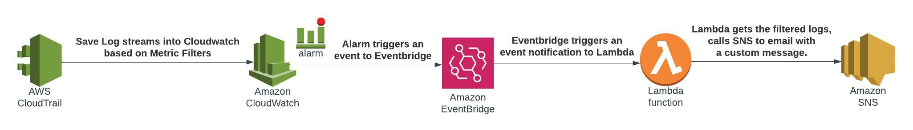

# terraform-aws-template

[](https://github.com/DNXLabs/terraform-aws-template/actions)
[](https://github.com/DNXLabs/terraform-aws-template/blob/master/LICENSE)

<!--- BEGIN_TF_DOCS --->

# AWS CloudTrail Notification Terraform Module

Terraform module to provision an CloudTrail with a custom notification.

## Introduction
- When you get an alarm, you want enough information to decide whether it needs immediate attention or not. You also want to customize the notification message to operational needs. The **CloudWatch Logs Customize Alarms** is a Lambda function that helps in reading the logs from CloudWatch Logs during an alarm and send a customized email through SNS.

## Flow of Events



## Prerequisites

- [CloudWatch log group](https://docs.aws.amazon.com/AmazonCloudWatch/latest/logs/Working-with-log-groups-and-streams.html) Logs has a Log group with a metric filter.
* [CloudWatch Alarm](https://docs.aws.amazon.com/AmazonCloudWatch/latest/logs/Working-with-log-groups-and-streams.html)  is created to trigger when that metric exceeds a threshold.
- [SNS](https://docs.aws.amazon.com/sns/latest/dg/sns-create-topic.html) subscription topic responsible to send the custom notification.

## Triggers
* The Lambda function is triggered on a EventBridge event.
* You need to provide the SNS topic.


## Usage

This example:.

```terraform
locals {
  log_group_name    = "LogGroupName"
  sns_topic_arn     = "arn:aws:sns:us-east-2:444455556666:MyTopic"
  cloud_watch_log_group_arn     = "arn:aws:logs:us-east-2:444455556666:MyLog"
}

module "cloudtrail_custom_alarms" {
  enabled ? 1 : 0
  cloudtrail_log_group_name     = local.log_group_name
  aws_sns_topic_arn             = local.sns_topic_arn
  lambda_timeout                = 5
  cloudwatch_log_cloudtrail_arn = local.cloud_watch_log_group_arn
}

```

## Requirements

| Name | Version |
|------|---------|
| <a name="requirement_terraform"></a> [terraform](#requirement\_terraform) | >= 1.0.0 |
| <a name="requirement_aws"></a> [aws](#requirement\_aws) | = 3.74.1 |


## Resources

| Name | Type |
|------|------|
| [aws_lambda_function.lambda](https://registry.terraform.io/providers/hashicorp/aws/latest/docs/resources/lambda_function) | resource |
| [aws_lambda_permission.default](https://registry.terraform.io/providers/hashicorp/aws/latest/docs/resources/lambda_permission) | resource |
| [aws_cloudwatch_log_group.alarm_lambda](https://registry.terraform.io/providers/hashicorp/aws/latest/docs/resources/cloudwatch_log_group) | resource |
| [aws_iam_role.iam_for_lambda](https://registry.terraform.io/providers/hashicorp/aws/latest/docs/resources/iam_role) | resource |
| [aws_iam_policy.lambda_cw](https://registry.terraform.io/providers/hashicorp/aws/latest/docs/resources/iam_policy) | resource |
| [aws_iam_role_policy_attachment.lambda_cw](https://registry.terraform.io/providers/hashicorp/aws/latest/docs/resources/iam_role_policy_attachment) | resource |
| [aws_cloudwatch_event_rule.alarm_notification](https://registry.terraform.io/providers/hashicorp/aws/latest/docs/resources/cloudwatch_event_rule) | resource |
| [aws_cloudwatch_event_target.lambda_target](https://registry.terraform.io/providers/hashicorp/aws/latest/docs/resources/cloudwatch_event_target) | resource |
| [aws_iam_policy_document.lambda_assume_role](https://registry.terraform.io/providers/hashicorp/aws/latest/docs/data-sources/iam_policy_document) | data source |
| [aws_caller_identity.current](https://registry.terraform.io/providers/hashicorp/aws/latest/docs/data-sources/caller_identity) | data source |
| [archive_file.lambda_zip](https://registry.terraform.io/providers/hashicorp/archive/latest/docs/data-sources/archive_file) | data source |


## Inputs

| Name | Description | Type | Default | Required |
|------|-------------|------|---------|:--------:|
| lambda_name | The name for the lambda resource for the custom message.  | `string` | `lambda_alarm_notification` | no |
| cloudtrail_log_group_name | The name of the cloudtrail logGroup that will get information from to create custom message. | `string` | n/a | yes |
| aws_sns_topic_arn | The ARN of SNS Topic where the notification will be sent | `string` | n/a | yes |
| lambda_timeout | Set lambda Timeout. | `number` | 3 | no |
| cloudwatch_log_cloudtrail_arn | Cloudwatch Loggroup ARN | `string` | n/a | yes |
| tags | A map of tags to add to all resources. | `map(string)` | `{}` | no |

## Outputs

| Name | Description |
|------|-------------|
| lambda_arn | The Lambda ARN. |


<!-- END_TF_DOCS -->

## License

Apache 2 Licensed. See [LICENSE](https://github.com/idealo/terraform-aws-opensearch/blob/main/LICENSE) for full details.